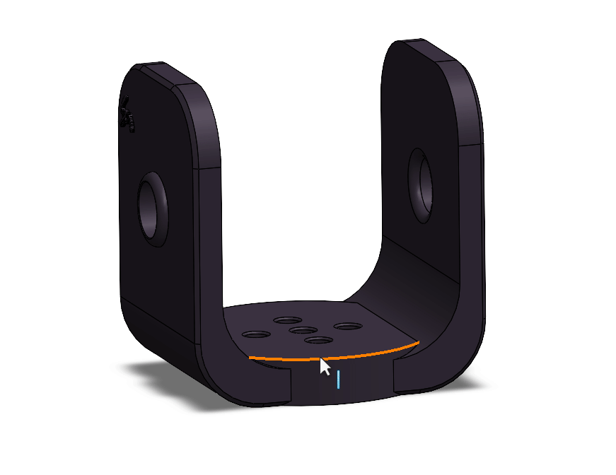
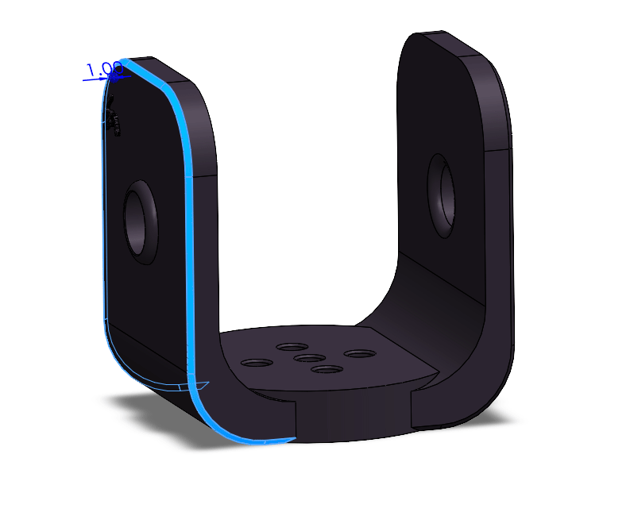
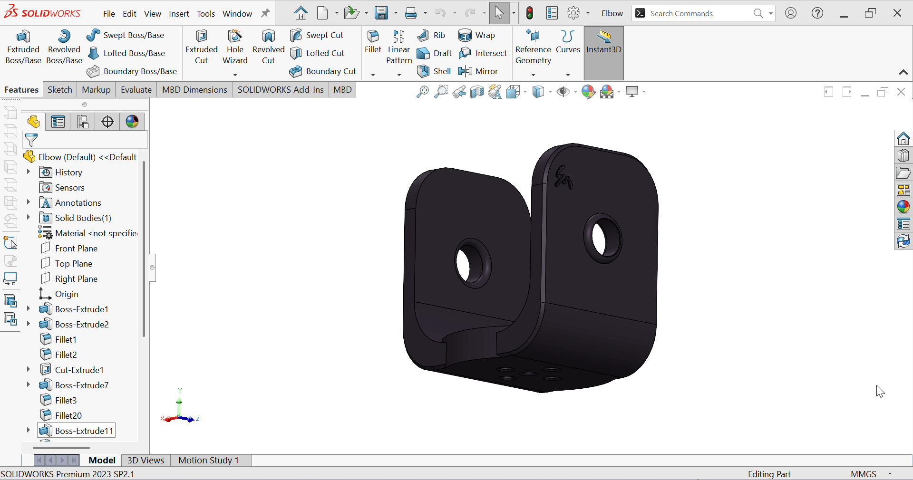

# Elbow Joint Design
Designing a **mechanical Elbow Joint** using **SolidWorks** with the goal of improving the geometric design and enhancing the overall aesthetics while maintaining the mechanical requirements.

## Tools & Features Used
- **SolidWorks 2023**  
- Commands:  
  - **Sketch**  
  - **Extrude Boss/Cut**  
  - **Fillet**  
  - **Chamfer**
 
## Elbow Joint Description
The elbow joint is a **U-shaped** part with a base containing cut-out openings to reduce weight and improve aesthetics, along with a circular hole at each vertical end.  
It is used to mechanically connect two parts while allowing for a certain rotation or movement angle.

## Design Improvements

### 1. Customized fillets for circular holes
Applied a larger fillet on the outer edges to make the profile stand out, and a smaller, smoother fillet on the inner edges for a refined finish and reduced sharpness.

### 2. Applied chamfers to outer edges and lightly to inner holes
Added chamfers to the main outer edges to create a sharper, more defined profile, and applied very light chamfers to the inner holes to maintain visual consistency in the design.

### 3. Added base cut-outs to reduce weight and improve appearance
Created cut-outs in the lower base section using Cut to reduce overall weight, applied fillets on the inner edges, and light chamfers on the outer edges to highlight the profile and maintain an aesthetic look.

### 4. Added custom logo
In the final stage of the design, the logo image was converted from **PNG** to **SVG** using [Vectorizer](https://vectorizer.io/) and then to **DXF** using [CloudConvert](https://cloudconvert.com/) for insertion into SolidWorks.  
The logo was placed on the surface of the part and embossed to reflect the project’s visual identity and add an extra aesthetic touch.

## Preview
*Front, Top, Left, and Trimetric views of the Elbow Joint.*

